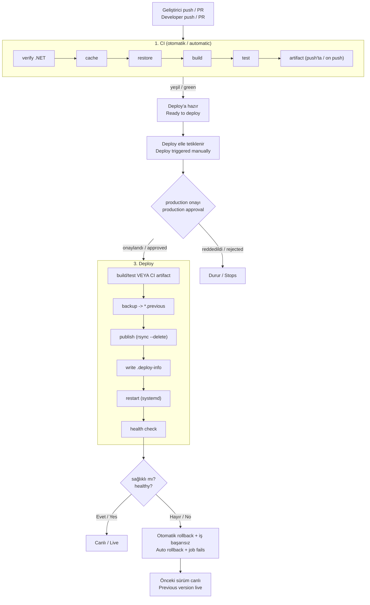
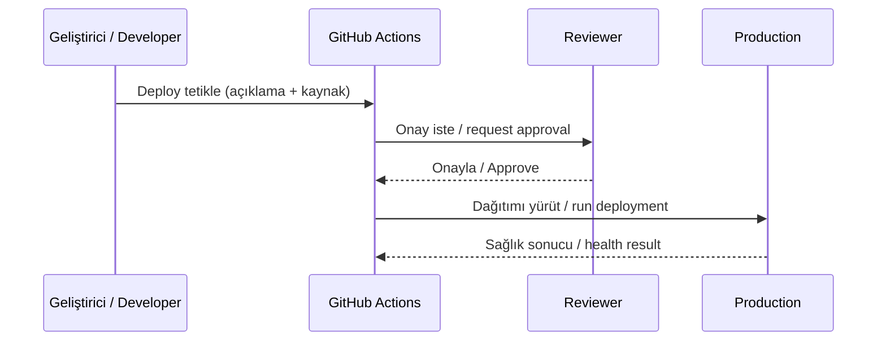

# CI/CD Pipeline Blueprint

**TR:** Projeden bağımsız, kopyala-yapıştır bir CI/CD boru hattı şablonu. Kendinden barındırmalı (self-hosted) bir GitHub Actions çalıştırıcısı üzerinde; otomatik derleme/test, onaya bağlı üretim dağıtımı, sağlık kontrolü ve hata durumunda otomatik geri alma sağlar. Herhangi bir .NET projesine tek bir `SERVICES` bloğu doldurularak dakikalar içinde uyarlanır.

**EN:** A project-agnostic, copy-paste CI/CD pipeline template. On a self-hosted GitHub Actions runner it provides automatic build/test, approval-gated production deployment, health checks and automatic rollback on failure. It adapts to any .NET project in minutes by filling in a single `SERVICES` block.

---

## İçindekiler / Table of Contents

- [Özellikler / Features](#özellikler--features)
- [Genel süreç akışı / Overall process flow](#genel-süreç-akışı--overall-process-flow)
- [1. Sürekli Entegrasyon (CI) / Continuous Integration](#1-sürekli-entegrasyon-ci--continuous-integration)
- [2. Yapı Çıktısı ve Build-Once/Deploy-Many / Artifacts](#2-yapı-çıktısı-ve-build-oncedeploy-many--artifacts)
- [3. Sürekli Dağıtım (Deploy) / Continuous Deployment](#3-sürekli-dağıtım-deploy--continuous-deployment)
- [4. Onay Mekanizması / Approval Gate](#4-onay-mekanizması--approval-gate)
- [5. Sağlık Kontrolü / Health Check](#5-sağlık-kontrolü--health-check)
- [6. Otomatik Geri Alma / Automatic Rollback](#6-otomatik-geri-alma--automatic-rollback)
- [7. Manuel Geri Alma / Manual Rollback](#7-manuel-geri-alma--manual-rollback)
- [8. Denetlenebilirlik / Auditability](#8-denetlenebilirlik--auditability)
- [9. Eşzamanlılık Koruması / Concurrency Guard](#9-eşzamanlılık-koruması--concurrency-guard)
- [Tek yapılandırma kaynağı / Single source of configuration](#tek-yapılandırma-kaynağı--single-source-of-configuration)
- [Uçtan uca senaryolar / End-to-end scenarios](#uçtan-uca-senaryolar--end-to-end-scenarios)
- [Hızlı başlangıç / Quick start](#hızlı-başlangıç--quick-start)
- [Dosya yapısı / File structure](#dosya-yapısı--file-structure)
- [Dokümantasyon / Documentation](#dokümantasyon--documentation)

---

## Özellikler / Features

| Özellik / Feature | Açıklama / Description |
|---|---|
| **Otomatik CI** | `main`'e her push ve PR'de otomatik derleme + test / Auto build + test on every push/PR to `main` |
| **Yapı çıktısı (artifact)** | Testten geçen çıktı saklanır, deploy'da yeniden kullanılır / Tested output is stored and reused at deploy |
| **Build-once, deploy-many** | Test edilen ile canlıya çıkan birebir aynı / What is tested equals what ships |
| **Onaya bağlı deploy** | Üretim için manuel onay kapısı (`production` environment) / Manual approval gate for production |
| **Sağlık kontrolü** | Deploy sonrası her servisin ayakta olduğu doğrulanır / Post-deploy verification per service |
| **Otomatik geri alma** | Sağlık başarısızsa önceki sürüme otomatik dönüş / Auto-revert on failed health check |
| **Manuel geri alma** | Önceki klasör veya belirli commit ile / Via previous folder or a specific commit |
| **Denetlenebilirlik** | Her dağıtımda kim/ne zaman/hangi commit kaydı / Who/when/which commit recorded per deploy |
| **Çok servis desteği** | Tek `SERVICES` bloğuyla N servis / N services via one `SERVICES` block |
| **Atomik güncelleme** | `rsync --delete` ile tutarlı dosya durumu / Consistent files via `rsync --delete` |
| **Eşzamanlılık koruması** | Çakışan deploy/rollback engellenir / Prevents clashing deploy/rollback |

---

## Genel süreç akışı / Overall process flow

**TR:** Aşağıdaki şema, bir kod değişikliğinin doğrulanmasından canlıya çıkmasına ve gerekirse geri alınmasına kadar tüm yolu gösterir. CI otomatiktir; Deploy ve Rollback bilinçli, onaylı eylemlerdir.

**EN:** The diagram below shows the full path of a code change from validation to going live and, if needed, being rolled back. CI is automatic; Deploy and Rollback are deliberate, approved actions.



---

## 1. Sürekli Entegrasyon (CI) / Continuous Integration

**TR:** CI, `main` dalına yapılan her `push` ve açılan her `pull_request` ile **otomatik** tetiklenir. Amacı, hatalı kodun daha ilk anda yakalanmasıdır. Sırasıyla şu adımlar koşar:

**EN:** CI is triggered **automatically** on every `push` to `main` and every `pull_request`. Its purpose is to catch faulty code as early as possible. It runs the following steps in order:

| # | Adım / Step | Ne yapar / What it does |
|---|---|---|
| 1 | .NET sürüm doğrulama / version check | Runner'da .NET 8+ SDK/runtime var mı / Ensures .NET 8+ on runner |
| 2 | NuGet cache | Paketleri önbelleğe alır, tekrarları hızlandırır / Caches packages, speeds up repeats |
| 3 | restore | Bağımlılıkları yükler / Restores dependencies |
| 4 | build (Release) | Çözümü derler / Builds the solution |
| 5 | test | Tüm test paketini çalıştırır / Runs the full test suite |
| 6 | artifact | Sadece `main`'e push'ta yapı çıktısı üretir / Produces build output only on push to `main` |

**TR:** Derleme/test mantığı yeniden kullanılabilir bir **bileşik eylem** (`build-test/action.yml`) içinde toplanmıştır; hem CI, hem "kaynaktan deploy", hem de commit tabanlı rollback aynı eylemi kullanır (kod tekrarı yok). CI'nin kendisi de `workflow_call` ile çağrılabilen **yeniden kullanılabilir bir iş akışıdır**.

**EN:** The build/test logic is gathered into a reusable **composite action** (`build-test/action.yml`); CI, "deploy from source" and commit-based rollback all use the same action (no duplication). CI itself is a **reusable workflow** callable via `workflow_call`.

---

## 2. Yapı Çıktısı ve Build-Once/Deploy-Many / Artifacts

**TR:** `main`'e push olduğunda, her servis yayımlanır (`dotnet publish`) ve hepsi **tek birleşik artifact** (`app-publish`) olarak 30 gün saklanır. Bu, boru hattının en önemli ilkelerinden birini mümkün kılar: **build-once, deploy-many.** Yani test edilen yapı ile canlıya çıkan yapı **birebir aynıdır**; deploy anında yeniden derlemeye gerek kalmadan bu doğrulanmış çıktı kullanılabilir (`ci_artifact` kaynağı).

**EN:** On push to `main`, each service is published (`dotnet publish`) and stored for 30 days as a **single combined artifact** (`app-publish`). This enables one of the pipeline's key principles: **build-once, deploy-many.** The tested build and the shipped build are **byte-for-byte identical**; at deploy time this validated output can be used without rebuilding (the `ci_artifact` source).

---

## 3. Sürekli Dağıtım (Deploy) / Continuous Deployment

**TR:** Deploy **otomatik değildir** — bilinçli, elle tetiklenen (`workflow_dispatch`) bir eylemdir. İki girdi alır:

**EN:** Deploy is **not automatic** — it is a deliberate, manually triggered (`workflow_dispatch`) action. It takes two inputs:

- `description` — **TR:** Bu dağıtımda neyin değiştiğinin açıklaması (zorunlu). / **EN:** A description of what changed in this deploy (required).
- `source` — **TR:** Kaynak: `build_from_source` (deploy anında kaynaktan derle) veya `ci_artifact` (son başarılı CI çıktısını kullan). / **EN:** Source: `build_from_source` (rebuild at deploy) or `ci_artifact` (use latest successful CI output).

**TR:** Onay verildikten sonra dağıtım şu adımlarla ilerler:

**EN:** After approval, the deployment proceeds through these steps:

| # | Adım / Step | Ne yapar / What it does |
|---|---|---|
| 1 | Kaynak hazırlığı / source prep | `build_from_source` → derle+test / `ci_artifact` → artifact indir |
| 2 | **backup** | Mevcut `/opt/...` dizinlerini `*.previous`'a kopyalar / Copies current dirs to `*.previous` |
| 3 | **publish** | Yeni sürümü `rsync -a --delete` ile hedefe yansıtır (atomik) / Mirrors new release atomically |
| 4 | **write-info** | `.deploy-info` dosyasına künye yazar / Writes deployment record |
| 5 | **restart** | Servisleri `systemctl restart` ile yeniler / Restarts services |
| 6 | **health** | Her servisin ayakta olduğunu doğrular / Verifies each service is up |
| 7 | başarısızsa / on fail | Otomatik rollback + işi başarısız say / Auto rollback + fail the job |

**TR:** Tüm bu ağır iş, tek bir `pipeline.sh` scriptinin alt komutlarıyla yapılır: `backup`, `publish-source`, `deploy-artifacts`, `write-info`, `restart`, `health`, `rollback`. Hepsi `SERVICES`'i okuyup tüm servisler üzerinde döner.

**EN:** All this heavy lifting is done by subcommands of a single `pipeline.sh` script: `backup`, `publish-source`, `deploy-artifacts`, `write-info`, `restart`, `health`, `rollback`. Each reads `SERVICES` and iterates over all services.

---

## 4. Onay Mekanizması / Approval Gate

**TR:** Üretimi etkileyen tüm iş akışları (`deploy`, `rollback`) GitHub'ın **`production` ortamına** bağlıdır. Bu ortama bir **required reviewer** tanımlandığında, iş akışı yürütülmeden önce durur ve yetkili birinin onayını bekler. Böylece:

**EN:** All workflows that affect production (`deploy`, `rollback`) are bound to GitHub's **`production` environment**. When a **required reviewer** is defined for it, the workflow pauses before running and waits for an authorized person's approval. As a result:

- **TR:** Hiçbir üretim dağıtımı, kimsenin haberi olmadan tek bir olayla gerçekleşemez. / **EN:** No production deploy can happen through a single event without anyone's awareness.
- **TR:** Onay bekleyen dağıtım GitHub arayüzünde görünür; kim tetikledi, hangi açıklamayla — hepsi kayıtlıdır. / **EN:** A pending deploy is visible in the GitHub UI; who triggered it and with what description — all recorded.
- **TR:** `run-name`, dağıtımı yapanı ve açıklamayı içerir (ör. `Deploy - Dedmoo - ana sayfa güncellendi`). / **EN:** `run-name` includes the actor and description (e.g., `Deploy - Dedmoo - homepage updated`).



---

## 5. Sağlık Kontrolü / Health Check

**TR:** Deploy'dan sonra servisin gerçekten çalışıp çalışmadığı `verify-health.sh` ile doğrulanır. Betik, her servisin `health_url`'i için sırasıyla üç göstergeyi dener ve **herhangi biri** olumluysa servisi sağlıklı kabul eder:

**EN:** After deploy, `verify-health.sh` checks whether the service actually runs. For each service's `health_url`, the script tries three indicators in order and considers the service healthy if **any** succeeds:

1. **TR:** `/health` ucu `{"status":"ok"}` döndürüyor mu / **EN:** the `/health` endpoint returns `{"status":"ok"}`
2. **TR:** `/health` HTTP 200 / **EN:** `/health` returns HTTP 200
3. **TR:** Kök `/` HTTP 200 / **EN:** the root `/` returns HTTP 200

**TR:** Kontrol, ayarlanabilir deneme sayısı ve bekleme ile tekrarlanır (varsayılan 12 deneme × 5 sn); servisin başlaması için zaman tanır. Bu tolerans, "servis daha yeni ayağa kalkıyor" ile "servis gerçekten çökmüş" durumlarını ayırt etmeyi sağlar.

**EN:** The check retries with a configurable count and wait (default 12 attempts × 5s), allowing time for the service to start. This tolerance distinguishes "the service is just starting" from "the service is actually down".

---

## 6. Otomatik Geri Alma / Automatic Rollback

**TR:** Deploy sırasında herhangi bir servisin sağlık kontrolü başarısız olursa, boru hattı **kendiliğinden** devreye girer: `*.previous` yedekleri varsa `pipeline.sh rollback` ile bir önceki sürüme döner, tekrar sağlık kontrolü yapar ve işi **başarısız** olarak işaretler. Bu *fail-safe* davranış, hatalı bir dağıtımın kullanıcıya kesinti olarak yansıma süresini en aza indirir — kimsenin gece yarısı müdahale etmesine gerek kalmaz.

**EN:** If any service's health check fails during deploy, the pipeline steps in **automatically**: if `*.previous` backups exist, it reverts to the previous release via `pipeline.sh rollback`, re-checks health, and marks the job as **failed**. This *fail-safe* behavior minimizes the time a faulty deploy is exposed to users — no one has to intervene at midnight.

---

## 7. Manuel Geri Alma / Manual Rollback

**TR:** Ayrıca istediğiniz an bilinçli olarak geri dönebilirsiniz. `rollback.yml` iki mod sunar:

**EN:** You can also deliberately revert at any time. `rollback.yml` offers two modes:

| Mod / Mode | Ne yapar / What it does | Ne zaman / When |
|---|---|---|
| `previous_folder` | `*.previous` yedeğinden anında dönüş (derleme yok) / Instant revert from backup (no rebuild) | Son dağıtım hatalı, hızlı dönüş gerek / Last deploy faulty, need fast return |
| `specific_commit` | Verilen commit'i derleyip yayımlar / Builds & ships a given commit | Daha eski, belirli bir noktaya dönüş / Return to a specific older point |

**TR:** Her iki modda da sonunda sağlık kontrolü koşulur; geri almanın da sağlıklı sonuç ürettiği doğrulanır. Rollback da `production` onayına tabidir.

**EN:** Both modes run a health check at the end, confirming the rollback itself is healthy. Rollback is also subject to `production` approval.

---

## 8. Denetlenebilirlik / Auditability

**TR:** Her dağıtımda, her servisin dizinine bir `.deploy-info` dosyası yazılır:

**EN:** On every deployment, a `.deploy-info` file is written into each service's directory:

```
deploy_time=2026-07-08T07:46:55Z
commit=abc123...
deployed_by=Dedmoo
note=ana sayfa metni güncellendi
```

**TR:** Böylece "şu an canlıda ne var, kim ne zaman koydu, hangi commit?" sorusu her zaman yanıtlanabilir. Ayrıca GitHub Actions'ın çalışma özeti (`GITHUB_STEP_SUMMARY`) her deploy/rollback için okunabilir bir rapor üretir.

**EN:** So "what is live right now, who put it there and when, which commit?" can always be answered. Additionally, GitHub Actions' run summary (`GITHUB_STEP_SUMMARY`) produces a readable report for each deploy/rollback.

---

## 9. Eşzamanlılık Koruması / Concurrency Guard

**TR:** Deploy ve rollback aynı `concurrency` grubunu (`deploy-<repo>`) paylaşır; böylece aynı anda iki dağıtım/geri alma çalışıp üretim dizinlerinde **yarış koşulu** oluşturması engellenir. CI ise dal başına ayrı bir grup kullanır ve eski çalışmayı iptal ederek çalıştırıcıyı gereksiz yükten korur.

**EN:** Deploy and rollback share the same `concurrency` group (`deploy-<repo>`), preventing two deploys/rollbacks from running at once and causing a **race condition** on production directories. CI uses a per-branch group and cancels the older run to protect the runner from unnecessary load.

---

## Tek yapılandırma kaynağı / Single source of configuration

**TR:** Sistemin tamamı tek bir `SERVICES` bloğuyla yapılandırılır. Her satır bir servisi tanımlar; bir veya N servis desteklenir. Port ve `dll` adı bu satırlardan otomatik türetilir.

**EN:** The entire system is configured with a single `SERVICES` block. Each line defines one service; one or N services are supported. The port and `dll` name are derived automatically from these lines.

```
name|csproj|deploy_dir|service_name|health_url
```

```
web|src/Web/Web.csproj|/opt/myapp-web|myapp-web|http://127.0.0.1:5001
api|src/Api/Api.csproj|/opt/myapp-api|myapp-api|http://127.0.0.1:5200
```

| Alan / Field | Anlamı / Meaning |
|---|---|
| `name` | Servis kimliği (artifact alt klasörü) / service id (artifact subfolder) |
| `csproj` | Yayımlanacak proje / project to publish |
| `deploy_dir` | Host'ta hedef dizin / target dir on host |
| `service_name` | systemd servis adı / systemd service name |
| `health_url` | Sağlık kontrolü taban adresi / health check base URL |

---

## Uçtan uca senaryolar / End-to-end scenarios

**TR — Bir değişiklik nasıl canlıya çıkar?**
1. Geliştirici `main`'e push eder → CI otomatik derler, test eder, artifact üretir.
2. Actions → **Deploy** → açıklama girilir, kaynak seçilir.
3. `production` onayı verilir.
4. backup → publish → restart → health → sağlıklıysa **canlı**.

**EN — How does a change go live?**
1. Developer pushes to `main` → CI auto builds, tests, produces an artifact.
2. Actions → **Deploy** → enter a description, pick a source.
3. `production` approval is granted.
4. backup → publish → restart → health → if healthy, **live**.

**TR — Hatalı bir deploy olursa ne olur?**
1. Health check başarısız olur.
2. Boru hattı otomatik olarak `*.previous`'a döner.
3. Tekrar health check yapılır, iş "başarısız" işaretlenir.
4. Kullanıcılar önceki çalışan sürümü görmeye devam eder.

**EN — What happens on a bad deploy?**
1. The health check fails.
2. The pipeline auto-reverts to `*.previous`.
3. Health is re-checked, the job is marked "failed".
4. Users keep seeing the previous working version.

---

## Hızlı başlangıç / Quick start

1. **TR:** `templates/.github` ve `templates/scripts` klasörlerini kendi deponuzun köküne kopyalayın. / **EN:** Copy `templates/.github` and `templates/scripts` to your repository root.
2. **TR:** `ci.yml`, `deploy.yml`, `rollback.yml` içindeki `SERVICES` / `services` bloğunu doldurun. / **EN:** Fill in the `SERVICES` / `services` blocks.
3. **TR:** Tüm workflow'larda `runs-on` etiketini kendi runner'ınıza göre ayarlayın. / **EN:** Set the `runs-on` label to your runner in all workflows.
4. **TR:** Host'ta bir kez çalıştırın / **EN:** Run once on the host:
   ```bash
   sudo SERVICES="web|src/Web/Web.csproj|/opt/myapp-web|myapp-web|http://127.0.0.1:5001" \
        bash scripts/setup-host.sh
   ```
5. **TR:** GitHub → Settings → Environments → `production` ekleyip **required reviewers** tanımlayın. / **EN:** GitHub → Settings → Environments → add `production` with **required reviewers**.
6. **TR:** `main`'e push edin (CI yeşil), sonra Deploy'u tetikleyin. / **EN:** Push to `main` (CI green), then trigger Deploy.

**TR:** Farklı teknoloji yığınları (Node.js, Java) için yalnızca üç komut (build/test, publish, run) değişir — ayrıntılar dokümanda.
**EN:** For other stacks (Node.js, Java) only three commands (build/test, publish, run) change — details in the docs.

---

## Dosya yapısı / File structure

```
cicd-blueprint/
├── README.md
├── docs/
│   ├── ci-cd-blueprint.tr.md      # Türkçe playbook
│   └── ci-cd-blueprint.en.md      # English playbook
└── templates/
    ├── .github/
    │   ├── actions/build-test/action.yml     # sürüm doğrulama + cache + build/test
    │   └── workflows/
    │       ├── ci.yml                         # push/PR -> reusable CI
    │       ├── reusable-dotnet-ci.yml         # build/test + (opsiyonel) tek artifact
    │       ├── deploy.yml                      # elle, onaylı, health + otomatik rollback
    │       └── rollback.yml                    # previous_folder | specific_commit
    └── scripts/
        ├── pipeline.sh            # backup/publish/deploy/restart/health/rollback
        ├── verify-health.sh       # /health -> / fallback
        └── setup-host.sh          # SERVICES'ten systemd birimleri üretir
```

---

## Dokümantasyon / Documentation

**TR:** Akademik düzeyde, ayrıntılı playbook (mimari, ilkeler, uyarlama rehberi, farklı yığınlar, kısıtlar):
**EN:** Academic-level, detailed playbook (architecture, principles, adaptation guide, other stacks, limitations):

| Dil / Language | Belge / Document |
|---|---|
| Türkçe | [`docs/ci-cd-blueprint.tr.md`](./docs/ci-cd-blueprint.tr.md) |
| English | [`docs/ci-cd-blueprint.en.md`](./docs/ci-cd-blueprint.en.md) |

> **TR:** Somut, doldurulmuş bir örnek için eShopOnWeb uyarlaması referans alınabilir. eShop yalnızca örnektir; bu şablonu kullanmak için gerekli değildir.
> **EN:** For a concrete, filled-in example see the eShopOnWeb adaptation. eShop is only an example; it is not required to use this template.
