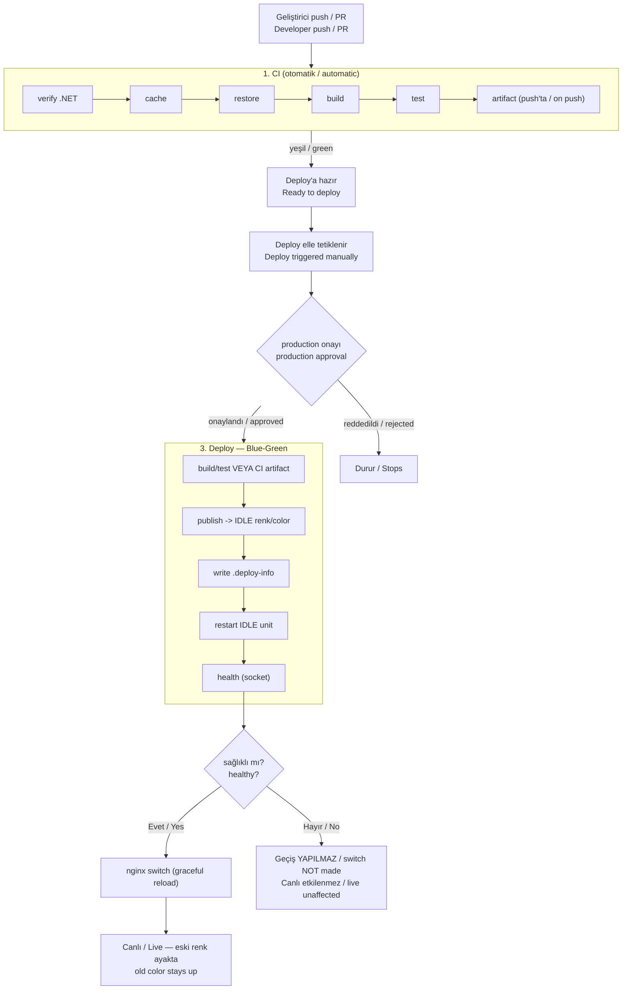
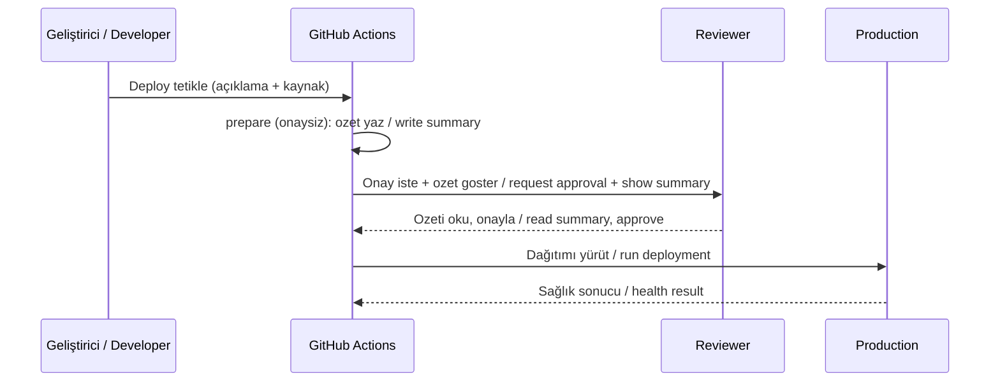
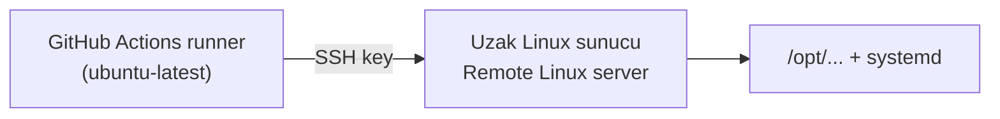

# CI/CD Pipeline Blueprint

**TR:** Projeden bağımsız, kopyala-yapıştır bir CI/CD boru hattı şablonu. Kendinden barındırmalı (self-hosted) bir GitHub Actions çalıştırıcısı üzerinde; otomatik derleme/test, onaya bağlı üretim dağıtımı, **sıfır kesintili blue-green dağıtım**, sağlık kontrolü, deploy öncesi geçiş engelleme (sağlık geçmezse trafik değişmez) ve onaylı anında geri alma sağlar. Herhangi bir .NET projesine tek bir `SERVICES` bloğu doldurularak dakikalar içinde uyarlanır.

**EN:** A project-agnostic, copy-paste CI/CD pipeline template. On a self-hosted GitHub Actions runner it provides automatic build/test, approval-gated production deployment, **zero-downtime blue-green deploys**, health checks, pre-switch protection (traffic never moves if health fails) and approval-gated instant rollback. It adapts to any .NET project in minutes by filling in a single `SERVICES` block.

**TR — İlk kez mi kuruyorsunuz?** Öğrenmeye gerek yok: [`docs/beginner-walkthrough.tr.md`](./docs/beginner-walkthrough.tr.md)  
**EN — First time setup?** No theory needed: [`docs/beginner-walkthrough.en.md`](./docs/beginner-walkthrough.en.md)

## Dokümantasyon / Documentation

**TR:** Hiç bilmeyen / ilk kez kuran için (öğrenme yok — tıklaya tıklaya):
**EN:** Complete beginners / first-time setup (no theory — click by click):

| Dil / Language | Belge / Document |
|---|---|
| Türkçe | [`docs/beginner-walkthrough.tr.md`](./docs/beginner-walkthrough.tr.md) |
| English | [`docs/beginner-walkthrough.en.md`](./docs/beginner-walkthrough.en.md) |

**TR:** Kendi .NET projenize sıfırdan tam entegrasyon (kod nereye + sunucu + GitHub, uçtan uca):
**EN:** Full from-scratch integration into your own .NET project (where code goes + server + GitHub, end to end):

| Dil / Language | Belge / Document |
|---|---|
| Türkçe | [`docs/kendi-projene-entegrasyon.tr.md`](./docs/kendi-projene-entegrasyon.tr.md) |
| English | [`docs/own-project-integration.en.md`](./docs/own-project-integration.en.md) |

**TR:** Firmaya özel ayarlar (Variables/Secrets/Environments) — tablo referansı:
**EN:** Company-specific settings (Variables/Secrets/Environments) — table reference:

| Dil / Language | Belge / Document |
|---|---|
| Türkçe | [`docs/company-setup.tr.md`](./docs/company-setup.tr.md) |
| English | [`docs/company-setup.en.md`](./docs/company-setup.en.md) |

**TR:** Akademik düzeyde, ayrıntılı playbook (mimari, ilkeler, uyarlama rehberi, farklı yığınlar, kısıtlar):
**EN:** Academic-level, detailed playbook (architecture, principles, adaptation guide, other stacks, limitations):

| Dil / Language | Belge / Document |
|---|---|
| Türkçe | [`docs/dotnet-cicd-template.tr.md`](./docs/dotnet-cicd-template.tr.md) |
| English | [`docs/dotnet-cicd-template.en.md`](./docs/dotnet-cicd-template.en.md) |

> **TR:** Somut, doldurulmuş bir örnek için eShopOnWeb uyarlaması referans alınabilir. eShop yalnızca örnektir; bu şablonu kullanmak için gerekli değildir.
> **EN:** For a concrete, filled-in example see the eShopOnWeb adaptation. eShop is only an example; it is not required to use this template.

---

## İçindekiler / Table of Contents

- [Dokümantasyon / Documentation](#dokümantasyon--documentation)
- [Özellikler / Features](#özellikler--features)
- [Genel süreç akışı / Overall process flow](#genel-süreç-akışı--overall-process-flow)
- [1. Sürekli Entegrasyon (CI) / Continuous Integration](#1-sürekli-entegrasyon-ci--continuous-integration)
- [2. Yapı Çıktısı ve Build-Once/Deploy-Many / Artifacts](#2-yapı-çıktısı-ve-build-oncedeploy-many--artifacts)
- [3. Sürekli Dağıtım (Deploy) / Continuous Deployment](#3-sürekli-dağıtım-deploy--continuous-deployment)
- [4. Onay Mekanizması / Approval Gate](#4-onay-mekanizması--approval-gate)
- [5. Sağlık Kontrolü / Health Check](#5-sağlık-kontrolü--health-check)
- [6. Otomatik Geri Alma / Automatic Rollback](#6-otomatik-geri-alma--automatic-rollback)
- [7. Manuel Geri Alma / Manual Rollback](#7-manuel-geri-alma--manual-rollback)
- [8. Denetlenebilirlik / Auditability](#8-denetlenebilirlik--auditability)
- [9. Eşzamanlılık Koruması / Concurrency Guard](#9-eşzamanlılık-koruması--concurrency-guard)
- [Kod yazmazsınız — sadece bilgi girersiniz / No code — you only fill in values](#kod-yazmazsınız--sadece-bilgi-girirsiniz--no-code--you-only-fill-in-values)
- [Uzak sunucu deploy (SSH) / Remote server deploy (SSH)](#uzak-sunucu-deploy-ssh--remote-server-deploy-ssh)
- [Kurulum checklist / Setup checklist](#kurulum-checklist--setup-checklist)
- [Uçtan uca senaryolar / End-to-end scenarios](#uçtan-uca-senaryolar--end-to-end-scenarios)
- [Hızlı başlangıç / Quick start](#hızlı-başlangıç--quick-start)
- [Dosya yapısı / File structure](#dosya-yapısı--file-structure)

---

## Özellikler / Features

| Özellik / Feature | Açıklama / Description |
|---|---|
| **Otomatik CI** | `main`'e her push ve PR'de otomatik derleme + test / Auto build + test on every push/PR to `main` |
| **Yapı çıktısı (artifact)** | Testten geçen çıktı saklanır, deploy'da yeniden kullanılır / Tested output is stored and reused at deploy |
| **Build-once, deploy-many** | Artifact bir kez üretilir; canlıya çıkan, testten geçen commit'in aynısından gelir (köken/commit garantisi) / Built once; what ships comes from the same verified commit that was tested (commit-level provenance) |
| **Onaya bağlı deploy** | Üretim için manuel onay kapısı (`production` environment) / Manual approval gate for production |
| **Sıfır kesinti (blue-green)** | nginx + Unix socket: yeni sürüm idle renge yazılır; sağlık geçince nginx trafiği çevirir — kullanıcı fark etmez / nginx + Unix socket: new version written to idle color; nginx switches on health pass — users notice nothing |
| **Sağlık kontrolü (socket)** | Geçiş öncesi idle rengin Unix socketi doğrulanır; başarısızsa nginx çevrilmez, canlı etkilenmez / Idle color Unix socket verified before switch; on failure nginx not switched, live unaffected |
| **Anında geri alma** | nginx upstream eski renge yeniden yazılır + graceful reload; sıfır kesinti / nginx upstream rewritten to previous color + graceful reload; zero-downtime |
| **Manuel geri alma** | Önceki renk (anlık, derleme yok) veya belirli commit (idle renge publish + switch) / Previous color (instant, no rebuild) or specific commit (publish to idle + switch) |
| **Denetlenebilirlik** | Her dağıtımda kim/ne zaman/hangi commit ve hangi renk kaydı / Who/when/which commit and which color recorded per deploy |
| **Çok servis desteği** | Tek `SERVICES` bloğuyla N servis / N services via one `SERVICES` block |
| **Eşzamanlılık koruması** | Çakışan deploy/rollback engellenir / Prevents clashing deploy/rollback |
| **Köken doğrulama (provenance)** | `ci_artifact`'ın commit'i, deploy commit'i ile birebir eşleşmezse deploy durur / Deploy stops if the artifact's commit does not match the deploy commit |
| **En az yetki (least privilege)** | İş akışları yalnızca gereken okuma yetkileriyle çalışır / Workflows run with only the minimal read permissions |

---

## Genel süreç akışı / Overall process flow

**TR:** Aşağıdaki şema, bir kod değişikliğinin doğrulanmasından canlıya çıkmasına ve gerekirse geri alınmasına kadar tüm yolu gösterir. CI otomatiktir; Deploy ve Rollback bilinçli, onaylı eylemlerdir.

**EN:** The diagram below shows the full path of a code change from validation to going live and, if needed, being rolled back. CI is automatic; Deploy and Rollback are deliberate, approved actions.



---

## 1. Sürekli Entegrasyon (CI) / Continuous Integration

**TR:** CI, `main` dalına yapılan her `push` ve açılan her `pull_request` ile **otomatik** tetiklenir. Amacı, hatalı kodun daha ilk anda yakalanmasıdır. Sırasıyla şu adımlar koşar:

**EN:** CI is triggered **automatically** on every `push` to `main` and every `pull_request`. Its purpose is to catch faulty code as early as possible. It runs the following steps in order:

| # | Adım / Step | Ne yapar / What it does |
|---|---|---|
| 1 | .NET sürüm doğrulama / version check | Runner'da .NET 8+ SDK/runtime var mı / Ensures .NET 8+ on runner |
| 2 | NuGet cache | Paketleri önbelleğe alır, tekrarları hızlandırır / Caches packages, speeds up repeats |
| 3 | restore | Bağımlılıkları yükler / Restores dependencies |
| 4 | build (Release) | Çözümü derler / Builds the solution |
| 5 | test | Tüm test paketini çalıştırır / Runs the full test suite |
| 6 | artifact | Sadece `main`'e push'ta yapı çıktısı üretir / Produces build output only on push to `main` |

**TR:** Derleme/test mantığı yeniden kullanılabilir bir **bileşik eylem** (`build-test/action.yml`) içinde toplanmıştır; hem CI, hem "kaynaktan deploy", hem de commit tabanlı rollback aynı eylemi kullanır (kod tekrarı yok). CI'nin kendisi de `workflow_call` ile çağrılabilen **yeniden kullanılabilir bir iş akışıdır**.

**EN:** The build/test logic is gathered into a reusable **composite action** (`build-test/action.yml`); CI, "deploy from source" and commit-based rollback all use the same action (no duplication). CI itself is a **reusable workflow** callable via `workflow_call`.

---

## 2. Yapı Çıktısı ve Build-Once/Deploy-Many / Artifacts

**TR:** `main`'e push olduğunda, her servis yayımlanır (`dotnet publish`) ve hepsi **tek birleşik artifact** (`app-publish`) olarak 30 gün saklanır. Bu, boru hattının en önemli ilkelerinden birini mümkün kılar: **build-once, deploy-many.** Artifact bir kez üretilir ve deploy anında yeniden derlenmeden birçok kez kullanılabilir (`ci_artifact` kaynağı). Garanti **köken/commit düzeyindedir**: deploy edilen artifact, testten geçen commit ile birebir aynı commit'ten üretilir (bkz. aşağıdaki köken doğrulama). Not: CI'de test `dotnet build` çıktısına karşı çalışır, artifact ise ayrı bir `dotnet publish` ile üretilir; dolayısıyla garanti *bayt düzeyinde ikili eşitlik* değil, aynı doğrulanmış commit'tir.

**EN:** On push to `main`, each service is published (`dotnet publish`) and stored for 30 days as a **single combined artifact** (`app-publish`). This enables one of the pipeline's key principles: **build-once, deploy-many.** The artifact is built once and can be deployed many times without rebuilding (the `ci_artifact` source). The guarantee is **commit-level provenance**: the deployed artifact is produced from the exact same commit that passed tests (see provenance below). Note: in CI the tests run against the `dotnet build` output while the artifact is produced by a separate `dotnet publish`, so the guarantee is the same verified commit — not *byte-for-byte binary equality*.

**TR — Köken doğrulama (provenance):** `ci_artifact` ile deploy edilirken, artifact'ı üreten CI çalışmasının commit'i (`headSha`) ile o an deploy edilen commit (`github.sha`) karşılaştırılır. Eşleşmezse deploy **durur**. Böylece "test edilen commit ile canlıya çıkan commit farklı" durumu engellenir; bu, `ci_artifact`'ı varsayılan ve güvenli kaynak yapan garantidir.

**EN — Provenance:** When deploying with `ci_artifact`, the commit of the CI run that produced the artifact (`headSha`) is compared with the commit being deployed (`github.sha`). If they differ, the deploy **stops**. This prevents "the tested commit differs from the shipped commit" and is the guarantee that makes `ci_artifact` the default, safe source.

---

## 3. Sürekli Dağıtım (Deploy) / Continuous Deployment

**TR:** Deploy **otomatik değildir** — bilinçli, elle tetiklenen (`workflow_dispatch`) bir eylemdir. İki girdi alır:

**EN:** Deploy is **not automatic** — it is a deliberate, manually triggered (`workflow_dispatch`) action. It takes two inputs:

- `description` — **TR:** Bu dağıtımda neyin değiştiğinin açıklaması (zorunlu). / **EN:** A description of what changed in this deploy (required).
- `source` — **TR:** Kaynak: `ci_artifact` (**varsayılan/önerilen** — son başarılı CI çıktısını kullanır, commit köken doğrulaması yapılır) veya `build_from_source` (deploy anında kaynaktan derler; ör. henüz CI artifact'ı olmayan ilk kurulum veya acil/hata ayıklama durumları). / **EN:** Source: `ci_artifact` (**default/recommended** — uses the latest successful CI output with commit provenance check) or `build_from_source` (rebuild at deploy; e.g. first setup with no CI artifact yet, or emergency/debug cases).

**TR:** Onay verildikten sonra dağıtım şu adımlarla ilerler:

**EN:** After approval, the deployment proceeds through these steps:

| # | Adım / Step | Ne yapar / What it does |
|---|---|---|
| 1 | Kaynak hazırlığı / source prep | `ci_artifact` → artifact indir + commit köken doğrulaması / download artifact + commit provenance check · `build_from_source` → derle+test / build+test |
| 2 | **publish (IDLE renk)** | Yeni sürümü **boş (idle) rengin** dizinine yazar; aktif renk dokunulmaz / Writes new version to the **idle color** dir; active color not touched |
| 3 | **write-env + write-info** | Gizli ortam ve künye idle renk dizinine yazılır / Secret env and deploy info written to idle color dir |
| 4 | **restart (IDLE)** | Yalnızca idle rengin systemd birimi başlatılır / Only the idle color systemd unit is restarted |
| 5 | **health (socket)** | Idle rengin Unix socketi üzerinden sağlık doğrulanır / Health verified via idle color Unix socket |
| 6 | sağlıklıysa / on pass | **nginx switch**: upstream dosyası yeniden yazılır + graceful reload → sıfır kesintili geçiş / upstream rewritten + graceful reload → zero-downtime switch |
| 7 | başarısızsa / on fail | Geçiş YAPILMAZ; canlı etkilenmez; job başarısız işaretlenir / Switch NOT made; live unaffected; job marked failed |

**TR:** Tüm bu ağır iş, tek bir `pipeline.sh` scriptinin alt komutlarıyla yapılır: `publish-source`, `deploy-artifacts`, `write-env`, `write-info`, `restart`, `health`, `health-active`, `switch`, `rollback`. Hepsi `SERVICES`'i okuyup tüm servisler üzerinde döner.

**EN:** All this heavy lifting is done by subcommands of a single `pipeline.sh` script: `publish-source`, `deploy-artifacts`, `write-env`, `write-info`, `restart`, `health`, `health-active`, `switch`, `rollback`. Each reads `SERVICES` and iterates over all services.

---

## 4. Onay Mekanizması / Approval Gate

**TR:** Üretimi etkileyen tüm iş akışları (`deploy`, `rollback`) GitHub'ın **`production` ortamına** bağlıdır. Bu ortama bir **required reviewer** tanımlandığında, iş akışı yürütülmeden önce durur ve yetkili birinin onayını bekler. Böylece:

**EN:** All workflows that affect production (`deploy`, `rollback`) are bound to GitHub's **`production` environment**. When a **required reviewer** is defined for it, the workflow pauses before running and waits for an authorized person's approval. As a result:

- **TR:** Hiçbir üretim dağıtımı, kimsenin haberi olmadan tek bir olayla gerçekleşemez. / **EN:** No production deploy can happen through a single event without anyone's awareness.
- **TR:** Onay bekleyen dağıtım GitHub arayüzünde görünür; kim tetikledi, hangi açıklamayla — hepsi kayıtlıdır. / **EN:** A pending deploy is visible in the GitHub UI; who triggered it and with what description — all recorded.
- **TR:** `run-name`, dağıtımı yapanı, açıklamayı ve commit'i içerir (ör. `Production Deploy | ana sayfa güncellendi | by Dedmoo | <sha>`). / **EN:** `run-name` includes the actor, description and commit (e.g., `Production Deploy | homepage updated | by Dedmoo | <sha>`).

**TR — Onaydan önce görünen özet (`prepare` job):** Her `deploy`/`rollback` çalışması, onay kapısından **önce** onaysız bir `prepare` job'u koşar. Bu job commit'i checkout edip **açıklama + commit kısa mesajı + SHA + kaynak + hedef** bilgisini çalışmanın **Summary** sekmesine yazar. Böylece onaylayan kişi `production-deploy.yml` dosyasını açmadan ne dağıtıldığını görür. **Onaylayan kişi, Actions çalışma sayfasındaki `prepare` özetine bakmadan onay vermemelidir.**

**EN — Summary shown before approval (`prepare` job):** Every `deploy`/`rollback` run executes an unapproved `prepare` job **before** the approval gate. It checks out the commit and writes **description + short commit message + SHA + source + target** to the run's **Summary** tab, so the reviewer sees exactly what is being deployed without opening `production-deploy.yml`. **The reviewer must not approve without first reading the `prepare` summary on the Actions run page.**

**TR — Önerilen `production` ortam sertleştirmesi (Settings → Environments → `production`):** Onay kapısını gerçekten etkili kılmak için şu ayarlar önerilir:

**EN — Recommended `production` environment hardening (Settings → Environments → `production`):** To make the approval gate genuinely effective, the following settings are recommended:

| Ayar / Setting | Neden / Why |
|---|---|
| **Required reviewers** (≥1) | Onaysız üretim dağıtımı olamaz / No unapproved production deploy |
| **Prevent self-review** | Deploy'u tetikleyen kişi kendi dağıtımını onaylayamaz / The triggering actor cannot approve their own deploy |
| **Deployment branches: yalnızca `main` / `main` only** | Yanlışlıkla feature dalından üretime çıkış engellenir / Prevents accidental deploys from a feature branch |
| **Wait timer** (ör. 5–15 dk, opsiyonel) | Onay sonrası "vazgeç" penceresi / A cancel window after approval |



---

## 5. Sağlık Kontrolü / Health Check

**TR:** Deploy adımlarından sonra, nginx trafik çevirmesinden **önce**, idle rengin **Unix socketi** üzerinden sağlık kontrolü yapılır. Bozuk sürüm canlıya hiç çıkmaz:

- Kontrol: `curl --unix-socket <sock> http://localhost/health` — HTTP 200 (12 deneme × 5 sn).
- Başarısızsa: nginx geçişi **yapılmaz**; aktif renk değişmez; kullanıcılar etkilenmez.
- Başarılıysa: nginx upstream dosyası yeniden yazılır + graceful reload → sıfır kesinti geçiş.

**EN:** After deploy steps, **before** nginx switches traffic, health is checked on the idle color's **Unix socket**. A broken version never reaches users:

- Check: `curl --unix-socket <sock> http://localhost/health` — HTTP 200 (12 attempts × 5s).
- On fail: nginx switch is **not made**; active color unchanged; users unaffected.
- On pass: nginx upstream file rewritten + graceful reload → zero-downtime switch.

**TR:** `verify-health.sh` beşinci argüman olarak Unix socket verilince soketten kontrol eder; verilmezse public URL'den. Manuel test için kullanılabilir.

**EN:** `verify-health.sh` checks via socket when a 5th (unix-socket) arg is given; otherwise via public URL. Useful for manual testing.

---

## 6. Otomatik Geri Alma / Automatic Rollback

**TR:** Blue-green modelde "otomatik rollback" kavramı farklı çalışır: sağlık başarısız olursa nginx geçişi **hiç yapılmaz**. Aktif renk değişmediğinden kullanıcılar eski (sağlıklı) sürümü görmeye kesintisiz devam eder. Kesinti süresi sıfır. İş "başarısız" işaretlenir; log incelenir, sorun giderilir, yeniden deploy tetiklenir.

**EN:** In the blue-green model, "auto-rollback" works differently: if health fails, the nginx switch is simply **not made**. The active color never changed, so users keep seeing the old (healthy) version without any interruption — downtime is zero. The job is marked "failed"; inspect logs, fix the issue, redeploy.

---

## 7. Manuel Geri Alma / Manual Rollback

**TR:** Ayrıca istediğiniz an bilinçli olarak geri dönebilirsiniz. `production-rollback.yml` iki mod sunar:

**EN:** You can also deliberately revert at any time. `production-rollback.yml` offers two modes:

| Mod / Mode | Ne yapar / What it does | Ne zaman / When |
|---|---|---|
| `previous_folder` | nginx upstream eski renge yeniden yazılır + graceful reload; **derleme yok, dosya kopyası yok**, sıfır kesinti (eski renk zaten çalışıyor) / nginx upstream rewritten to old color + graceful reload; **no rebuild, no file copy**, zero-downtime (old color already running) | Son dağıtım hatalı, hızlı dönüş gerek / Last deploy faulty, need fast return |
| `specific_commit` | Verilen commit idle renge derlenir, sağlık geçince nginx geçişi yapılır / Given commit built to idle color, nginx switched on health pass | Daha eski, belirli bir noktaya dönüş / Return to a specific older point |

**TR:** Her iki modda da sonunda socket üzerinden sağlık kontrolü koşulur. `previous_folder` modunda trafik **switch öncesi** hedef renk doğrulanır: dizin mevcut olmalı, publish DLL içermeli ve socket sağlıklı olmalı; nginx reload veya state yazımı başarısız olursa upstream otomatik eski renge döner. Rollback da `production` onayına tabidir.

**EN:** Both modes end with a socket-based health check. In `previous_folder` mode, the target color is validated **before** the switch: directory must exist, contain the published DLL, and pass socket health; if nginx reload or state write fails, upstream is automatically reverted. Rollback is also subject to `production` approval.

---

## 8. Denetlenebilirlik / Auditability

**TR:** Her dağıtımda, her servisin dizinine bir `.deploy-info` dosyası yazılır:

**EN:** On every deployment, a `.deploy-info` file is written into each service's directory:

```
deploy_time=2026-07-08T07:46:55Z
commit=abc123...
deployed_by=Dedmoo
note=ana sayfa metni güncellendi
```

**TR:** Böylece "şu an canlıda ne var, kim ne zaman koydu, hangi commit?" sorusu her zaman yanıtlanabilir. Ayrıca GitHub Actions'ın çalışma özeti (`GITHUB_STEP_SUMMARY`) her deploy/rollback için okunabilir bir rapor üretir.

**EN:** So "what is live right now, who put it there and when, which commit?" can always be answered. Additionally, GitHub Actions' run summary (`GITHUB_STEP_SUMMARY`) produces a readable report for each deploy/rollback.

---

## 9. Eşzamanlılık Koruması / Concurrency Guard

**TR:** Deploy ve rollback aynı `concurrency` grubunu (`deploy-<repo>`) paylaşır; böylece aynı anda iki dağıtım/geri alma çalışıp üretim dizinlerinde **yarış koşulu** oluşturması engellenir. CI ise dal başına ayrı bir grup kullanır ve eski çalışmayı iptal ederek çalıştırıcıyı gereksiz yükten korur.

**EN:** Deploy and rollback share the same `concurrency` group (`deploy-<repo>`), preventing two deploys/rollbacks from running at once and causing a **race condition** on production directories. CI uses a per-branch group and cancels the older run to protect the runner from unnecessary load.

---

## Kod yazmazsınız — sadece bilgi girersiniz / No code — you only fill in values

**TR:** Bu şablon **boru hattının kendisidir** (workflow'lar + scriptler); sizin uygulama kodunuzu içermez. Onu kullanmak için **hiçbir dosyayı düzenlemezsiniz.** Projenize özel tüm bilgiler (proje yolları, runner, IP/bağlantı dizeleri, API anahtarları) GitHub arayüzünden **Variables** ve **Secrets** olarak girilir; workflow'lar bunları okur. Bilgileri girdiğiniz an kullanıma hazırdır.

**EN:** This template is **the pipeline itself** (workflows + scripts); it does not contain your application code. To use it you **edit no files.** All project-specific values (project paths, runner, IP/connection strings, API keys) are entered from the GitHub UI as **Variables** and **Secrets**; the workflows read them. It is ready to use the moment you fill them in.

**Settings → Secrets and variables → Actions**

| Tür / Type | Ad / Name | Zorunlu / Required | İçerik / Content |
|---|---|---|---|
| Variable | `DEPLOY_TARGET` | Hayır / No | `local` (varsayılan) veya **`remote`** (uzak sunucu) |
| Variable | `SERVICES` | Evet / Yes | Servis listesi (aşağıya bakın) / service list (see below) |
| Variable | `RUNNER_LABEL` | Hayır / No | `ubuntu-latest` (remote önerilir) veya `self-hosted` |
| Variable | `SSH_HOST` | remote için / for remote | Uzak sunucu IP veya hostname / remote server IP or hostname |
| Variable | `SSH_USER` | remote için / for remote | SSH kullanıcısı (ör. `deploy`) / SSH user (e.g. `deploy`) |
| Variable | `SSH_PORT` | Hayır / No | SSH portu (varsayılan `22`) / SSH port (default `22`) |
| Variable | `SSH_KNOWN_HOSTS` | remote için zorunlu / required for remote | Sunucu host key satırı (`ssh-keyscan` çıktısı). MITM korumasıdır; boş bırakılırsa uzak deploy reddedilir / server host key line. MITM protection; remote deploy is refused if empty |
| Variable | `RUN_ENSURE_INFRA` | Hayır / No | `true` ise deploy öncesi `scripts/ensure-infra.sh` çalışır (DB migration vb.; önce scripti düzenleyin) / if `true`, runs `scripts/ensure-infra.sh` before deploy (DB migrations etc.; customize the script first) |
| Variable | `ARTIFACT_NAME` | Hayır / No | Artifact adı (varsayılan `app-publish`) |
| Secret | `SSH_PRIVATE_KEY` | remote için / for remote | Deploy SSH **private key** (şifresiz bağlantı) |
| Secret | `APP_ENV` | Hayır / No | `KEY=VALUE`: bağlantı dizeleri, API anahtarları |

### `SERVICES` değişkeni / variable

**TR:** Sistemin tamamı bu tek değişkenle yapılandırılır. Her satır bir servisi tanımlar; bir veya N servis desteklenir. Port ve `dll` adı satırlardan otomatik türetilir.

**EN:** The entire system is configured by this single variable. Each line defines one service; one or N services are supported. The port and `dll` name are derived automatically.

```
name|csproj|deploy_dir|service_name|health_url
```

```
web|src/Web/Web.csproj|/opt/myapp-web|myapp-web|http://127.0.0.1:5001
api|src/Api/Api.csproj|/opt/myapp-api|myapp-api|http://127.0.0.1:5200
```

| Alan / Field | Anlamı / Meaning |
|---|---|
| `name` | Servis kimliği (artifact alt klasörü) / service id (artifact subfolder) |
| `csproj` | Yayımlanacak proje / project to publish |
| `deploy_dir` | Host'ta hedef dizin / target dir on host |
| `service_name` | systemd servis adı / systemd service name |
| `health_url` | Sağlık kontrolü taban adresi / health check base URL |

### `APP_ENV` secret'i / secret (opsiyonel / optional)

**TR:** Gizli yapılandırma (bağlantı dizeleri, API anahtarları) burada `KEY=VALUE` satırları olarak tutulur. Deploy sırasında her servisin dizinine `.env` olarak yazılır ve systemd servisine `EnvironmentFile` ile enjekte edilir. .NET, `ConnectionStrings__X` gibi ortam değişkenlerini `appsettings` üzerine otomatik uygular — yani kod değişikliği gerekmez.

**EN:** Secret configuration (connection strings, API keys) is kept here as `KEY=VALUE` lines. At deploy it is written as `.env` into each service dir and injected into the systemd service via `EnvironmentFile`. .NET automatically applies env vars like `ConnectionStrings__X` over `appsettings` — so no code change is needed.

```
ConnectionStrings__CatalogConnection=Server=10.0.0.5,1433;User Id=sa;Password=...;TrustServerCertificate=true
ConnectionStrings__IdentityConnection=Server=10.0.0.5,1433;User Id=sa;Password=...;TrustServerCertificate=true
SomeApi__ApiKey=sk-...
```

---

## Uzak sunucu deploy (SSH) / Remote server deploy (SSH)

**TR:** Üretim sunucuları uzaktaysa (runner'ın yanında değilse) `DEPLOY_TARGET=remote` kullanın. GitHub Actions runner'da derleme yapılır; deploy **SSH key ile şifresiz** uzak sunucuya `rsync` + `systemctl` ile yapılır. Her deploy'da şifre girilmez — private key GitHub **Secret**'ında saklanır.

**EN:** When production servers are remote (not co-located with the runner), use `DEPLOY_TARGET=remote`. Build runs on the GitHub Actions runner; deploy reaches the remote server **passwordlessly via SSH key** using `rsync` + `systemctl`. No password is entered per deploy — the private key is stored as a GitHub **Secret**.



### 1. Deploy SSH key oluştur / Create deploy SSH key

**TR** (bir kez, güvenli makinede):

```bash
ssh-keygen -t ed25519 -f deploy_key -N "" -C "cicd-deploy"
```

- `deploy_key` → **private** → GitHub Secret: `SSH_PRIVATE_KEY` (tüm içeriği kopyala)
- `deploy_key.pub` → **public** → uzak sunucuya ekle:

```bash
ssh-copy-id -i deploy_key.pub -p 22 deploy@10.0.0.5
# veya sunucuda: echo "..." >> ~/.ssh/authorized_keys
```

**EN:** Generate once on a secure machine; put the private key in `SSH_PRIVATE_KEY`, public key in the server's `authorized_keys`.

### 2. GitHub Variables / Secrets (remote)

| Ad / Name | Örnek / Example |
|---|---|
| `DEPLOY_TARGET` | `remote` |
| `SSH_HOST` | `10.0.0.5` |
| `SSH_USER` | `deploy` |
| `SSH_PORT` | `22` |
| `RUNNER_LABEL` | `ubuntu-latest` |
| `SSH_PRIVATE_KEY` (Secret) | `deploy_key` dosyasının içeriği |

**TR:** Blue-green modelde `health_url` iki amaçla kullanılır: (1) **PORT** kısmı nginx'in public portu olarak `setup-host.sh` tarafından alınır; (2) **PATH** kısmı (`/health` vb.) socket sağlık kontrolünde kullanılır. IP kısmı pipeline tarafından yoksayılır.

**EN:** In blue-green, `health_url` serves two purposes: (1) the **PORT** is used by `setup-host.sh` as nginx's public port; (2) the **PATH** (`/health` etc.) is used by the socket health check. The IP part is ignored by the pipeline.

### 3. Uzak sunucuda tek seferlik kurulum / One-time remote host setup

**TR:** nginx + systemd birimlerini uzak sunucuda oluşturmak için (SSH ile, bir kez):

```bash
DEPLOY_TARGET=remote \
SSH_HOST=10.0.0.5 SSH_USER=deploy SSH_PORT=22 \
SSH_KNOWN_HOSTS="$(ssh-keyscan -p 22 10.0.0.5)" \
SSH_PRIVATE_KEY="$(cat deploy_key)" \
SERVICES="web|src/Web/Web.csproj|/opt/myapp-web|myapp-web|http://10.0.0.5:5001/health" \
bash scripts/setup-remote-host.sh
```

**EN:** Creates nginx config and systemd units on the remote server over SSH (one-time setup).

### 4. Uzak kullanıcı yetkileri / Remote user permissions

**TR:** Deploy kullanıcısının **şifresiz `sudo`** yetkisi olmalıdır. Pipeline, dağıtım adımlarını (`mkdir`, `cp`, `rm`, `chown`, `mv`, `chmod`, `systemctl`) tek bir bileşik komut olarak `sudo bash -c "..."` ile çalıştırır; bu nedenle komut bazlı dar bir whitelist **çalışmaz** ve tam yetki gerekir:

```
deploy ALL=(ALL) NOPASSWD: ALL
```

**Not:** Bu tam `sudo` yetkisidir. Daha kısıtlı bir kurulum istiyorsanız, `deploy` kullanıcısını yalnızca bu dağıtım sunucusuna özel açın (başka görev vermeyin). (`pkill` gerekmez — yeniden başlatma yalnızca `systemctl` ile yapılır.)

**EN:** The deploy user needs **passwordless `sudo`**. The pipeline runs each deployment step (`mkdir`, `cp`, `rm`, `chown`, `mv`, `chmod`, `systemctl`) as a single compound command via `sudo bash -c "..."`, so a narrow per-command whitelist **does not work** and full privilege is required (`deploy ALL=(ALL) NOPASSWD: ALL`). This is full `sudo`; for a tighter setup, dedicate the `deploy` user to this deployment server only. (`pkill` is not required — restarts use `systemctl` only.)

### Local vs Remote

| | `local` | `remote` |
|---|---|---|
| Runner konumu | Uygulama ile aynı makine | Herhangi (ör. `ubuntu-latest`) |
| Sunucuya SSH | Gerekmez | **SSH key gerekir** |
| `health_url` PORT | nginx dinleyecek public port | nginx dinleyecek public port |
| Kurulum | `setup-host.sh` (yerel) | `setup-remote-host.sh` (SSH) |

### Sorun giderme (uzak/remote bağlantı) / Troubleshooting (remote connection)

**TR:** Uzak sunucuya bağlanırken en sık karşılaşılan durumlar ve çözümleri. Çoğu sorun SSH anahtarı, host doğrulaması veya sudo yetkisi kaynaklıdır.

**EN:** The most common situations when connecting to a remote server, and their fixes. Most issues come from the SSH key, host verification or sudo permissions.

| Belirti / Symptom | Olası neden / Likely cause | Çözüm / Fix |
|---|---|---|
| `kex_exchange_identification: Connection reset by peer` / bağlantı arada sıfırlanıyor | Modern sshd (OpenSSH 9.8+) çok sayıda kısa/doğrulamasız bağlantıyı `PerSourcePenalties` ile cezalandırır. Genelde her adımda `ssh-keyscan` yapılmasından tetiklenir. | `SSH_KNOWN_HOSTS` variable'ını doldurun (aşağıya bakın) — böylece `ssh-keyscan` tekrarlanmaz. Gerekirse sunucuda `sshd_config` → `PerSourcePenalties no` (dikkatli olun). |
| `Host key verification failed` | `StrictHostKeyChecking=yes` açık ve host `known_hosts`'ta yok. | `SSH_KNOWN_HOSTS` variable'ına host anahtarını koyun: `ssh-keyscan -p <port> <host>` çıktısını yapıştırın. |
| `Permission denied (publickey)` | Public key sunucuda yok, yanlış kullanıcı veya izinler hatalı. | `deploy_key.pub`'ı `~<SSH_USER>/.ssh/authorized_keys`'e ekleyin; `SSH_USER` doğru olsun; `chmod 700 ~/.ssh`, `chmod 600 authorized_keys`. |
| `Load key ... invalid format` / `error in libcrypto` | `SSH_PRIVATE_KEY` secret'ı eksik/bozuk yapıştırılmış. | Anahtarın **tümünü** (`-----BEGIN...` ve `-----END...` satırları dahil) yapıştırın. `ed25519` ve **şifresiz** (passphrase yok) key kullanın. |
| `sudo: a password is required` / restart adımı takılıyor | Deploy kullanıcısında şifresiz `sudo` yok. | Sunucuda sudoers (`visudo`): `deploy ALL=(ALL) NOPASSWD: ALL` (komutlar `sudo bash -c` ile çalıştığından dar whitelist yetmez). |
| Health başarısız ama servis ayakta | `health_url` runner'dan erişilemiyor (`127.0.0.1` yazılmış) veya port firewall'da kapalı. | Remote'ta `health_url = http://<sunucu-ip>:port`; güvenlik grubunda/firewall'da o portu runner'a açın. |
| `Connection timed out` | Port/firewall veya yanlış `SSH_HOST`/`SSH_PORT`. | Sunucuda 22 (veya `SSH_PORT`) portunu runner IP'sine açın; `SSH_HOST` ve `SSH_PORT` değerlerini doğrulayın. |
| `rsync: command not found` | rsync runner'da **veya** sunucuda kurulu değil. | İki tarafta da kurun: `sudo apt-get install -y rsync`. |
| İlk deploy'da `App.dll bulunamadı` | `setup-remote-host.sh` çalıştı ama henüz deploy yapılmadı (`/opt/...` boş). | Önce bir Deploy tetikleyin; systemd servisi ilk yayından sonra ayağa kalkar. |

**TR — `SSH_KNOWN_HOSTS` nasıl alınır (remote için zorunlu):**

**EN — How to get `SSH_KNOWN_HOSTS` (required for remote):**

```bash
ssh-keyscan -p 22 10.0.0.5
# çıktının tamamını / the whole output ->  Variable: SSH_KNOWN_HOSTS
```

**TR:** Bunu doldurmak hem "host key verification" hatasını hem de tekrarlı `ssh-keyscan` kaynaklı bağlantı sıfırlanmalarını önler. **Boş bırakılırsa uzak deploy reddedilir** (MITM koruması — otomatik kabul fallback'i kaldırıldı).

**EN:** Setting this avoids both the "host key verification" error and the connection resets caused by repeated `ssh-keyscan`. **If left empty, remote deploy is refused** (MITM protection — the auto-accept fallback was removed).

---

## Kurulum checklist / Setup checklist

**TR:** Aşağıdaki tablo, projeyi kullanıma hazır hâle getirmek için **neyi nerede değiştireceğinizi** özetler. Workflow veya script dosyalarını düzenlemeniz gerekmez.

**EN:** The table below summarizes **what to change where** to make the project ready to use. You do not need to edit workflow or script files.

### Neyi nerede değiştirirsiniz? / What to change where

| Nerede / Where | Ne değişir / What you change | Zorunlu / Required | Kaç kez / How often |
|---|---|---|---|
| GitHub repo → **Use this template** | Yeni repo oluşturma / create your copy | Evet / Yes | 1 kez / once |
| Repo kökü | `templates/.github` → `.github`, `templates/scripts` → `scripts` kopyala / copy | Evet / Yes | 1 kez / once |
| **Settings → Variables** → `DEPLOY_TARGET` | `remote` (uzak sunucu) veya `local` | remote için / for remote | 1 kez |
| **Settings → Variables** → `SSH_HOST`, `SSH_USER` | Uzak sunucu IP ve kullanıcı / remote IP and user | remote için | 1 kez |
| **Settings → Secrets** → `SSH_PRIVATE_KEY` | Deploy SSH private key | remote için | 1 kez |
| **Settings → Variables** → `SERVICES` | Proje yolu, deploy dizini, **health_url = sunucu IP** | Evet / Yes | Proje başına |
| Aynı yer → `RUNNER_LABEL` | `ubuntu-latest` (remote) veya `self-hosted` (local) | Hayır / No | Gerekirse |
| **Settings → Secrets** → `APP_ENV` | DB / API gizli ayarlar | Hayır / No | Gerekirse |
| **Settings → Environments** → `production` | Onaylayan kişi + sertleştirme (self-review engelle, yalnızca `main`) / reviewer + hardening (prevent self-review, `main` only) | Evet / Yes | 1 kez |
| Uzak sunucu (remote) | `bash scripts/setup-remote-host.sh` (SSH ile systemd) | remote için | 1 kez |
| Yerel host (local) | `sudo bash scripts/setup-host.sh` | local için | 1 kez |

### Kullanıma hazır olma sırası / Ready-to-use sequence

**TR (uzak sunucu / remote — önerilen / recommended)**

1. **Use this template** → yeni repo
2. `templates/` içeriğini repo köküne taşı
3. Deploy SSH key oluştur → public key sunucuya, private key → Secret `SSH_PRIVATE_KEY`
4. Variables: `DEPLOY_TARGET=remote`, `SSH_HOST`, `SSH_USER`, `SERVICES` (health_url = sunucu IP)
5. `RUNNER_LABEL=ubuntu-latest`, `production` + reviewer
6. `bash scripts/setup-remote-host.sh` (bir kez)
7. Push → CI → Deploy + onay

**EN (remote — recommended)**

1. **Use this template** → new repo
2. Move `templates/` to repo root
3. Create deploy SSH key → public on server, private in `SSH_PRIVATE_KEY`
4. Variables: `DEPLOY_TARGET=remote`, `SSH_HOST`, `SSH_USER`, `SERVICES` (health_url = server IP)
5. `RUNNER_LABEL=ubuntu-latest`, `production` + reviewer
6. `bash scripts/setup-remote-host.sh` (once)
7. Push → CI → Deploy + approve

**TR (yerel / local — runner = sunucu)**

1. [github.com/Dedmoo/dotnet-cicd-template](https://github.com/Dedmoo/dotnet-cicd-template) → **Use this template** → yeni repo oluştur
2. `templates/.github` ve `templates/scripts` klasörlerini repo **köküne** taşı
3. Variables: `DEPLOY_TARGET=local` (veya boş), `SERVICES`, `RUNNER_LABEL=self-hosted`
4. (Opsiyonel) Secret `APP_ENV`
5. **Settings → Environments** → `production` + **required reviewers**
6. Runner makinesinde: `sudo SERVICES="..." bash scripts/setup-host.sh`
7. `main`'e push → CI → Deploy

**EN (local — runner on same machine)**

1. **Use this template** → new repo
2. Move `templates/.github` and `templates/scripts` to repo root
3. Variables: `DEPLOY_TARGET=local` (or empty), `SERVICES`, `RUNNER_LABEL=self-hosted`
4. (Optional) Secret `APP_ENV`
5. **Settings → Environments** → `production` + **required reviewers**
6. On runner machine: `sudo SERVICES="..." bash scripts/setup-host.sh`
7. Push to `main` → CI → Deploy

### Düzenlenmeyen dosyalar / Files you do not edit

**TR:** `continuous-integration.yml`, `production-deploy.yml`, `production-rollback.yml`, `pipeline.sh` ve diğer şablon dosyalarına dokunmayın. Tüm proje bilgileri yalnızca GitHub **Variables** / **Secrets** üzerinden okunur.

**EN:** Do not touch `continuous-integration.yml`, `production-deploy.yml`, `production-rollback.yml`, `pipeline.sh` or other template files. All project values are read only from GitHub **Variables** / **Secrets**.

---

## Uçtan uca senaryolar / End-to-end scenarios

**TR — Bir değişiklik nasıl canlıya çıkar?**
1. Geliştirici `main`'e push eder → CI otomatik derler, test eder, artifact üretir.
2. Actions → **Deploy** → açıklama girilir, kaynak seçilir.
3. `production` onayı verilir.
4. Yeni sürüm **idle renge** yayınlanır → idle yeniden başlatılır → socket sağlık geçer → nginx graceful reload → **sıfır kesintili geçiş**.

**EN — How does a change go live?**
1. Developer pushes to `main` → CI auto builds, tests, produces an artifact.
2. Actions → **Deploy** → enter a description, pick a source.
3. `production` approval is granted.
4. New version published to **idle color** → idle restarted → socket health passes → nginx graceful reload → **zero-downtime switch**.

**TR — Hatalı bir deploy olursa ne olur?**
1. Idle renkin socket sağlık kontrolü başarısız olur.
2. nginx geçişi **yapılmaz** — aktif renk değişmez.
3. İş "başarısız" işaretlenir.
4. Kullanıcılar önceki çalışan sürümü **kesintisiz** görmeye devam eder.

**EN — What happens on a bad deploy?**
1. The idle color socket health check fails.
2. The nginx switch is **not made** — active color unchanged.
3. The job is marked "failed".
4. Users keep seeing the previous working version **without any interruption**.

---

## Hızlı başlangıç / Quick start

**TR:** Dosya düzenlemeden. Sadece kopyalayın ve arayüzden bilgileri girin:
**EN:** No file editing. Just copy and fill in values from the UI:

1. **TR:** `templates/.github` ve `templates/scripts` klasörlerini kendi deponuzun köküne kopyalayın. / **EN:** Copy `templates/.github` and `templates/scripts` to your repository root.
2. **TR:** GitHub → Settings → Secrets and variables → Actions → **Variables**: `SERVICES` (ve gerekiyorsa `RUNNER_LABEL`) ekleyin. / **EN:** Add the `SERVICES` variable (and `RUNNER_LABEL` if needed).
3. **TR:** (Opsiyonel) **Secrets** → `APP_ENV`: bağlantı dizeleri / API anahtarları. / **EN:** (Optional) Secret `APP_ENV`: connection strings / API keys.
4. **TR:** GitHub → Settings → Environments → `production` ekleyip **required reviewers** tanımlayın; **prevent self-review** ve **yalnızca `main`** dalını açın (onay kapısı sertleştirmesi). / **EN:** Add a `production` environment with **required reviewers**; enable **prevent self-review** and **`main`-only** branch (approval gate hardening).
5. **TR:** Host'ta bir kez (systemd birimlerini kurar) / **EN:** Once on the host (creates systemd units):
   ```bash
   sudo SERVICES="web|src/Web/Web.csproj|/opt/myapp-web|myapp-web|http://127.0.0.1:5001" \
        bash scripts/setup-host.sh
   ```
6. **TR:** `main`'e push edin (CI yeşil), sonra Actions → **Production Deploy**'u tetikleyin. / **EN:** Push to `main` (CI green), then Actions → trigger **Production Deploy**.

**TR:** Not: `SERVICES` değerini adım 2'de girdiğiniz değişkenden kopyalayıp adım 5'te kullanın (aynı değer). Farklı yığınlar (Node.js, Java) için yalnızca üç komut (build/test, publish, run) değişir — ayrıntılar dokümanda.
**EN:** Note: use the same `SERVICES` value from step 2 in step 5. For other stacks (Node.js, Java) only three commands (build/test, publish, run) change — details in the docs.

---

## Dosya yapısı / File structure

```
dotnet-cicd-template/
├── README.md
├── docs/
│   ├── beginner-walkthrough.tr.md  # hiç bilmeyenler (TR)
│   ├── beginner-walkthrough.en.md  # complete beginners (EN)
│   ├── company-setup.tr.md         # firma kurulum referansı (TR)
│   ├── company-setup.en.md         # company setup reference (EN)
│   ├── kendi-projene-entegrasyon.tr.md  # kendi .NET projene tam entegrasyon (TR)
│   ├── own-project-integration.en.md    # full own-project integration (EN)
│   ├── dotnet-cicd-template.tr.md  # Türkçe playbook
│   └── dotnet-cicd-template.en.md  # English playbook
└── templates/
    ├── .github/
    │   ├── actions/build-test/action.yml     # sürüm doğrulama + cache + build/test
    │   └── workflows/
    │       ├── continuous-integration.yml     # push/PR -> reusable CI
    │       ├── reusable-dotnet-build.yml      # build/test + (opsiyonel) tek artifact
    │       ├── production-deploy.yml          # elle, onaylı, health + otomatik rollback
    │       └── production-rollback.yml        # previous_folder | specific_commit
    └── scripts/
        ├── pipeline.sh            # local + remote deploy/rollback
        ├── ensure-infra.sh        # opsiyonel: deploy oncesi DB migration hook
        ├── ssh-remote.sh          # SSH key, rsync, remote commands
        ├── setup-remote-host.sh   # uzak sunucuda systemd kurulumu (SSH)
        ├── verify-health.sh
        └── setup-host.sh          # yerel systemd kurulumu
```
