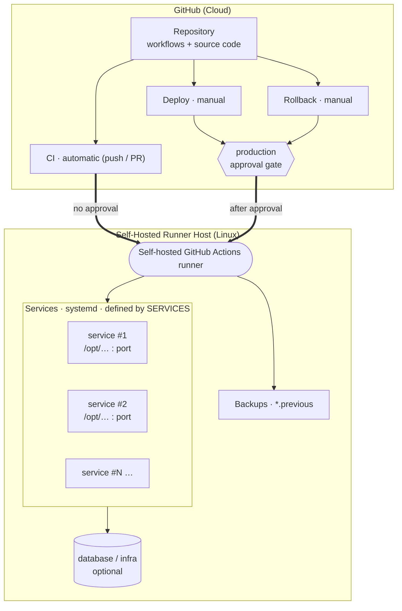
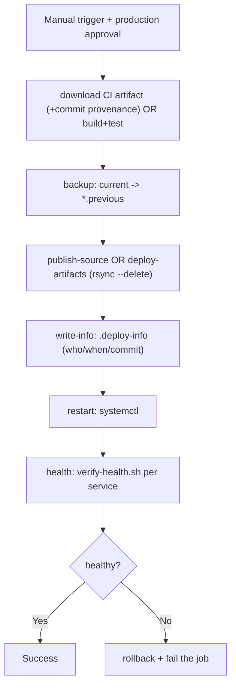

# CI/CD Pipeline Blueprint

## A Project-Agnostic Continuous Integration and Continuous Deployment Pattern on a Self-Hosted Runner

**Document language:** English (Turkish version: [`ci-cd-blueprint.tr.md`](./ci-cd-blueprint.tr.md))
**Goal:** A reusable CI/CD pattern adaptable to any .NET project in about 15 minutes.

---

## Abstract

This document presents a **project-agnostic** CI/CD (Continuous Integration / Continuous Deployment) pipeline pattern, along with accompanying copy-paste template files that are not tied to any specific application. The goal is to make a once-designed delivery discipline (automatic build/test, approval-gated production deployment, health checks and automatic rollback) portable to new projects at low cost. At the center of the design is a **single source of configuration** (`SERVICES`); by filling in only this block, a user can manage one or many services through the same pipeline. The pattern is built on technology-agnostic principles (build-once/deploy-many, approval gate, fail-safe rollback); the concrete templates target .NET/ASP.NET Core but can be adapted to other stacks by changing only three commands.

**Keywords:** CI/CD, DevOps, GitHub Actions, self-hosted runner, template, reusability, automatic rollback.

---

## Table of Contents

1. [Design Philosophy](#1-design-philosophy)
2. [Architecture Pattern](#2-architecture-pattern)
3. [Single Source of Configuration: `SERVICES`](#3-single-source-of-configuration-services)
4. [Pipeline Components](#4-pipeline-components)
5. [Universal Principles](#5-universal-principles)
6. [Adapting to Your Project (Step by Step)](#6-adapting-to-your-project-step-by-step)
7. [Different Technology Stacks](#7-different-technology-stacks)
8. [File Structure Reference](#8-file-structure-reference)
9. [Evaluation and Limitations](#9-evaluation-and-limitations)
10. [Appendix: Concrete Example (eShopOnWeb)](#10-appendix-concrete-example-eshoponweb)
11. [Glossary and References](#11-glossary-and-references)

---

## 1. Design Philosophy

Most CI/CD documentation is tightly coupled to a specific application, which renders it useless for other projects. The core goal of this template is the opposite: **to reduce everything application-specific to a variable.** Ports, deployment directories, service names and health endpoints are treated not as "constants" but as "parameters." Thus, the pipeline's logic (when it builds, who approves, when it rolls back) stays unchanged, while "what" is deployed can vary from project to project.

This approach rests on three engineering principles:

- **Single source of truth:** Service definitions live only in the `SERVICES` block; they are not repeated anywhere.
- **DRY (Don't Repeat Yourself):** Build/test logic is gathered into a composite action, and deploy/rollback logic into a single script.
- **Fail-safe default:** A faulty deployment is automatically rolled back; the default behavior protects the user.

## 2. Architecture Pattern

The pattern comprises three logical layers and remains the same regardless of which application is used:



The number of services (one, two, or more) depends only on the number of lines added to the `SERVICES` block; the workflows iterate over these lines.

## 3. Single Source of Configuration: `SERVICES`

The entire system is configured with a simple text block in the following format. Each line represents one service:

```
name|csproj|deploy_dir|service_name|health_url
```

| Field | Meaning | Example |
|---|---|---|
| `name` | Short identifier of the service (artifact subfolder) | `web` |
| `csproj` | Project file to publish | `src/Web/Web.csproj` |
| `deploy_dir` | Target directory on the host | `/opt/myapp-web` |
| `service_name` | systemd service name | `myapp-web` |
| `health_url` | Health check base URL | `http://127.0.0.1:5001` |

This block is defined in one place as a **repo variable (`vars.SERVICES`)** on GitHub; `ci.yml`, `deploy.yml` and `rollback.yml` read this variable (no file editing needed). In host setup, the same value is passed once to `setup-host.sh` as an environment variable. CI uses only the first two fields (`name|csproj`); the rest are ignored.

**Derived values:** The `dll` name is derived from `csproj` (`Web.csproj` → `Web.dll`), and the binding port is extracted automatically from `health_url`. This keeps `SERVICES` free of redundant fields.

## 4. Pipeline Components

### 4.1 CI (`ci.yml` + `reusable-dotnet-ci.yml` + `build-test` action)

- **Trigger:** Every `push` and every `pull_request` to `main`.
- **Does:** .NET version validation → NuGet cache → restore → build → test.
- **Artifact:** Only on push to `main`, each service is published under `PUBLISH_ROOT/<name>` and retained for 30 days as a **single combined artifact** (`app-publish`).
- **Why decoupled?** This tested output can later be deployed unchanged (*build-once, deploy-many*).
- **Permissions:** Workflows run with least privilege (`permissions: contents: read`); the token's scope is not left needlessly broad.

### 4.2 Deploy (`deploy.yml` + `pipeline.sh`)

Manually triggered (`workflow_dispatch`), taking two inputs: `description` (mandatory) and `source`. The `source` default is **`ci_artifact`** (recommended): it uses the latest successful CI output and performs a **commit provenance check** — if the commit of the CI run that produced the artifact (`headSha`) does not match the deployed commit (`github.sha`), the deploy stops. `build_from_source` rebuilds from source at deploy time (for first setup or emergency/debug). Flow:



`pipeline.sh` subcommands: `backup`, `publish-source`, `deploy-artifacts`, `write-info`, `restart`, `health`, `rollback`. All read `SERVICES` and iterate over all services.

### 4.3 Rollback (`rollback.yml`)

Two modes: `previous_folder` (instant reversion from the `*.previous` backup) and `specific_commit` (builds and publishes a given commit). A health check runs at the end of both modes.

## 5. Universal Principles

| Principle | How it is applied | Benefit |
|---|---|---|
| Build-once, deploy-many | `ci_artifact` source (default) | Tested equals released, byte-for-byte |
| Provenance | `ci_artifact` commit == deploy commit | The tested commit equals the released commit |
| Approval gate | `environment: production` + reviewer/self-review/`main` | Prevents unauthorized production deploys |
| Least privilege | `permissions: contents: read` (+ `actions: read` on deploy) | Narrows the token's scope |
| Auditability | `.deploy-info` + `run-name` | Who/when/why record |
| Atomic update | staging + `rsync --delete` | No partial/mixed file state |
| Fail-safe | health + automatic rollback | Minimizes impact of a faulty deploy |
| Race-condition prevention | `concurrency` group | Concurrent deploys do not clash |

## 6. Adapting to Your Project (Step by Step)

To use this template you **edit no files.** All application-specific values are entered from the GitHub UI as **Variables** and **Secrets**; the workflows read them.

1. **Copy the template:** Copy `templates/.github` and `templates/scripts` to the root of your own repository.
2. **Add Variables:** GitHub → Settings → Secrets and variables → Actions → Variables:
   - `SERVICES` (required): the service list, one line each `name|csproj|deploy_dir|service_name|health_url`.
   - `RUNNER_LABEL` (optional): runner label (default `self-hosted`).
   - `ARTIFACT_NAME` (optional): artifact name (default `app-publish`).
3. **Add Secrets (optional):** Put `KEY=VALUE` lines into the `APP_ENV` secret (connection strings, API keys). At deploy it is injected into each service as `.env`; .NET applies them over `appsettings` automatically.
4. **Create and harden the `production` environment:** Settings → Environments → add `production`; define **required reviewers**, enable **prevent self-review**, and restrict deployments to the **`main`** branch only (you may add an optional **wait timer**). These settings make the approval gate genuinely effective.
5. **Prepare the host:** Once on the runner machine (with the same `SERVICES` value as step 2):
   ```bash
   sudo SERVICES="web|src/Web/Web.csproj|/opt/myapp-web|myapp-web|http://127.0.0.1:5001" \
        bash scripts/setup-host.sh
   ```
   (For multiple services, `SERVICES` can be multi-line.)
6. **Run the first CI:** Push to `main`; confirm it is green.
7. **Perform the first deployment:** Actions → Deploy → enter a description, approve.

## 7. Different Technology Stacks

The pipeline's logic is technology-agnostic; only **three points** are specific to .NET and can be changed easily:

| Stage | .NET (default) | Node.js example | Java example |
|---|---|---|---|
| Build/test | `dotnet build/test` (`build-test` action) | `npm ci && npm test` | `mvn verify` |
| Publish | `dotnet publish` (`pipeline.sh`) | `npm run build` | `mvn package` |
| Run | `dotnet App.dll --urls ...` (`setup-host.sh`) | `node dist/server.js` | `java -jar app.jar` |

Updating these three commands is sufficient to move the pattern to a different stack; the approval, health-check, backup and rollback logic remains as is.

## 8. File Structure Reference

```
templates/
├── .github/
│   ├── actions/
│   │   └── build-test/
│   │       └── action.yml         # version check + cache + restore/build/test
│   └── workflows/
│       ├── ci.yml                 # push/PR -> reusable CI
│       ├── reusable-dotnet-ci.yml # build/test + (optional) single artifact
│       ├── deploy.yml             # manual, approval-gated, health + auto-rollback
│       └── rollback.yml           # previous_folder | specific_commit
└── scripts/
    ├── pipeline.sh                # backup/publish/deploy/restart/health/rollback
    ├── verify-health.sh           # /health -> swagger/root fallback
    └── setup-host.sh              # generates systemd units from SERVICES
```

## 9. Evaluation and Limitations

**Strengths:** Single source of configuration, N-service support, low adaptation cost, fail-safe deployment, technology-agnostic logic.

**Limitations and recommendations:**

- **A single runner** is a single point of failure; multiple runners are recommended for critical environments.
- **Zero-downtime deployment** is not provided; a brief outage may occur during restart. It can be extended with blue-green/canary.
- **Database migrations** are not part of the pipeline; the optional "ensure infra" step in `deploy.yml` is reserved for this.
- **Secrets** should be kept in GitHub Secrets / a secret vault rather than in configuration files.

## 10. Appendix: Concrete Example (eShopOnWeb)

A fully filled-in (placeholder-free) instance of this pattern is implemented on Microsoft eShopOnWeb. Running with two .NET services (Web storefront on 5001, PublicApi on 5200) and a SQL Server instance, this example can be used as a reference for how the template is filled in practice. In the example, `SERVICES` is filled as follows:

```
web|src/Web/Web.csproj|/opt/eshopweb|eshopweb|http://127.0.0.1:5001
api|src/PublicApi/PublicApi.csproj|/opt/eshopapi|eshopapi|http://127.0.0.1:5200
```

> Note: eShopOnWeb is only an example; you do not need it to use this template.

## 11. Glossary and References

**Glossary**

| Term | Description |
|---|---|
| CI | Continuous Integration; automatic build and test of every change. |
| CD | Continuous Deployment; transfer of a validated build to the environment. |
| Artifact | The stored build output produced by a CI run. |
| Self-hosted runner | An agent executing workflows on your own server. |
| Health check | A check verifying that the service is up and responsive. |
| Rollback | Returning production to a previous working state. |

**References**

1. GitHub, *GitHub Actions Documentation*. https://docs.github.com/actions
2. GitHub, *Reusing workflows* & *Creating composite actions*. https://docs.github.com/actions/using-workflows/reusing-workflows
3. Humble, J. & Farley, D. (2010). *Continuous Delivery*. Addison-Wesley.
4. Microsoft, *.NET Documentation*. https://learn.microsoft.com/dotnet
