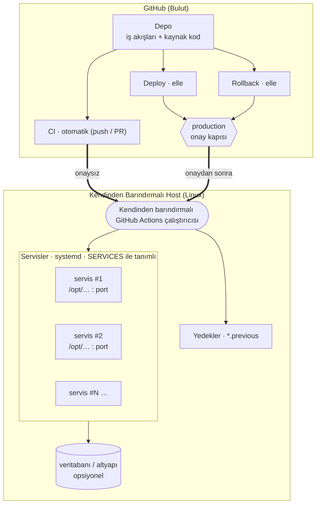
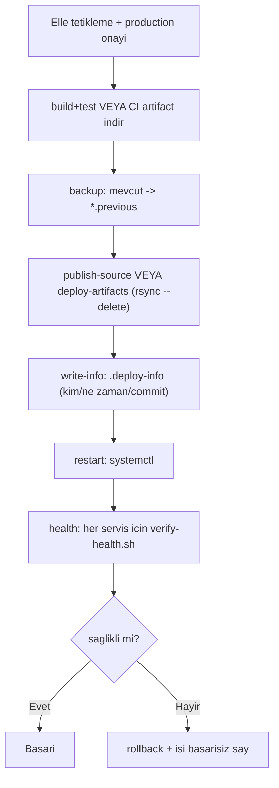

# CI/CD Boru Hattı Şablonu (Blueprint)

## Kendinden Barındırmalı Çalıştırıcı Üzerinde Projeden Bağımsız Sürekli Entegrasyon ve Sürekli Dağıtım Deseni

**Belge dili:** Türkçe (İngilizce sürüm: [`ci-cd-blueprint.en.md`](./ci-cd-blueprint.en.md))
**Amaç:** Herhangi bir .NET projesine 15 dakikada uyarlanabilen, tekrar kullanılabilir bir CI/CD deseni.

---

## Özet

Bu belge, belirli bir uygulamaya bağlı olmayan, **projeden bağımsız** bir CI/CD (Sürekli Entegrasyon / Sürekli Dağıtım) boru hattı desenini ve buna eşlik eden kopyala-yapıştır şablon dosyalarını sunar. Amaç, bir kez tasarlanan teslim disiplininin (otomatik derleme/test, onaya bağlı üretim dağıtımı, sağlık kontrolü ve otomatik geri alma) yeni projelere düşük maliyetle taşınabilmesidir. Tasarımın merkezinde **tek bir yapılandırma kaynağı** (`SERVICES`) yer alır; kullanıcı yalnızca bu bloğu doldurarak bir veya birden çok servisi aynı boru hattıyla yönetebilir. Desen, teknoloji bağımsız ilkeler (build-once/deploy-many, onay kapısı, fail-safe rollback) üzerine kuruludur; somut şablonlar .NET/ASP.NET Core hedefler ancak yalnızca üç komut değiştirilerek başka yığınlara uyarlanabilir.

**Anahtar kelimeler:** CI/CD, DevOps, GitHub Actions, kendinden barındırmalı çalıştırıcı, şablon, yeniden kullanılabilirlik, otomatik geri alma.

---

## İçindekiler

1. [Tasarım Felsefesi](#1-tasarım-felsefesi)
2. [Mimari Deseni](#2-mimari-deseni)
3. [Tek Yapılandırma Kaynağı: `SERVICES`](#3-tek-yapılandırma-kaynağı-services)
4. [Boru Hattı Bileşenleri](#4-boru-hattı-bileşenleri)
5. [Evrensel İlkeler](#5-evrensel-i̇lkeler)
6. [Kendi Projenize Uyarlama (Adım Adım)](#6-kendi-projenize-uyarlama-adım-adım)
7. [Farklı Teknoloji Yığınları](#7-farklı-teknoloji-yığınları)
8. [Dosya Yapısı Referansı](#8-dosya-yapısı-referansı)
9. [Değerlendirme ve Kısıtlar](#9-değerlendirme-ve-kısıtlar)
10. [Ek: Somut Örnek (eShopOnWeb)](#10-ek-somut-örnek-eshoponweb)
11. [Sözlük ve Kaynakça](#11-sözlük-ve-kaynakça)

---

## 1. Tasarım Felsefesi

Çoğu CI/CD dokümantasyonu belirli bir uygulamaya sıkı sıkıya bağlıdır; bu da onları başka projelerde işe yaramaz hâle getirir. Bu şablonun temel hedefi bunun tersidir: **uygulamaya özgü her şeyi bir değişkene indirgemek.** Portlar, dağıtım dizinleri, servis adları ve sağlık uçları birer "sabit" değil, birer "parametre" olarak ele alınır. Böylece boru hattının mantığı (ne zaman derlenir, kim onaylar, ne zaman geri alınır) değişmeden kalırken; "neyin" dağıtıldığı projeden projeye değişebilir.

Bu yaklaşım üç mühendislik ilkesine dayanır:

- **Tek sorumluluk kaynağı (single source of truth):** Servis tanımları yalnızca `SERVICES` bloğunda yaşar; hiçbir yerde tekrarlanmaz.
- **Kuru kod (DRY):** Derleme/test mantığı bir bileşik eyleme, dağıtım/geri alma mantığı tek bir script'e toplanır.
- **Güvenli varsayılan (fail-safe):** Hatalı bir dağıtım otomatik olarak geri alınır; varsayılan davranış kullanıcıyı korumaktır.

## 2. Mimari Deseni

Desen üç mantıksal katmandan oluşur ve hangi uygulama kullanılırsa kullanılsın aynı kalır:



Servis sayısı (bir, iki veya daha fazla) yalnızca `SERVICES` bloğuna eklenen satır sayısına bağlıdır; iş akışları bu satırların üzerinde döngü kurar.

## 3. Tek Yapılandırma Kaynağı: `SERVICES`

Tüm sistem, aşağıdaki biçimdeki basit bir metin bloğuyla yapılandırılır. Her satır bir servisi temsil eder:

```
name|csproj|deploy_dir|service_name|health_url
```

| Alan | Anlamı | Örnek |
|---|---|---|
| `name` | Servisin kısa kimliği (artifact alt klasörü) | `web` |
| `csproj` | Yayımlanacak proje dosyası | `src/Web/Web.csproj` |
| `deploy_dir` | Host üzerinde hedef dizin | `/opt/myapp-web` |
| `service_name` | systemd servis adı | `myapp-web` |
| `health_url` | Sağlık kontrolü taban adresi | `http://127.0.0.1:5001` |

Bu blok, GitHub'da bir **repo değişkeni (`vars.SERVICES`)** olarak tek yerde tanımlanır; `ci.yml`, `deploy.yml` ve `rollback.yml` bu değişkeni okur (dosya düzenlemesi gerekmez). Host kurulumunda ise aynı değer `setup-host.sh`'ye ortam değişkeni olarak bir kez geçirilir. CI'de yalnızca ilk iki alan (`name|csproj`) kullanılır; diğerleri yok sayılır.

**Türetilen değerler:** `dll` adı `csproj`'den (`Web.csproj` → `Web.dll`), bağlanma portu ise `health_url`'den otomatik çıkarılır. Böylece `SERVICES` gereksiz alanlarla şişmez.

## 4. Boru Hattı Bileşenleri

### 4.1 CI (`ci.yml` + `reusable-dotnet-ci.yml` + `build-test` eylemi)

- **Tetikleme:** `main`'e her `push` ve her `pull_request`.
- **Yapar:** .NET sürüm doğrulama → NuGet cache → restore → build → test.
- **Artifact:** Yalnızca `main`'e push'ta, her servis `PUBLISH_ROOT/<name>` altına yayımlanır ve **tek birleşik artifact** (`app-publish`) olarak 30 gün saklanır.
- **Neden ayrık?** Testten geçen bu çıktı, daha sonra dağıtımda değişmeden kullanılabilir (*build-once, deploy-many*).

### 4.2 Deploy (`deploy.yml` + `pipeline.sh`)

Elle tetiklenir (`workflow_dispatch`), iki girdi alır: `description` (zorunlu açıklama) ve `source` (`build_from_source` veya `ci_artifact`). Akış:



`pipeline.sh` alt komutları: `backup`, `publish-source`, `deploy-artifacts`, `write-info`, `restart`, `health`, `rollback`. Hepsi `SERVICES`'i okur ve tüm servisler üzerinde döner.

### 4.3 Rollback (`rollback.yml`)

İki mod: `previous_folder` (`*.previous` yedeğinden anında dönüş) ve `specific_commit` (verilen commit'i derleyip yayımlar). Her iki modda sonunda sağlık kontrolü koşulur.

## 5. Evrensel İlkeler

| İlke | Nasıl uygulanır | Kazanç |
|---|---|---|
| Build-once, deploy-many | `ci_artifact` kaynağı | Test edilen ile yayınlanan birebir aynı |
| Onay kapısı | `environment: production` | İzinsiz üretim dağıtımı engellenir |
| Denetlenebilirlik | `.deploy-info` + `run-name` | Kim/ne zaman/neden kaydı |
| Atomik güncelleme | staging + `rsync --delete` | Yarım/karışık dosya durumu olmaz |
| Fail-safe | health + otomatik rollback | Hatalı dağıtımın etkisi en aza iner |
| Yarış koşulu önleme | `concurrency` grubu | Eşzamanlı dağıtımlar çakışmaz |

## 6. Kendi Projenize Uyarlama (Adım Adım)

Bu şablonu kullanmak için **hiçbir dosyayı düzenlemezsiniz.** Uygulamaya özgü tüm değerler GitHub arayüzünden **Variables** ve **Secrets** olarak girilir; iş akışları bunları okur.

1. **Şablonu kopyalayın:** `templates/.github` ve `templates/scripts` klasörlerini kendi deponuzun köküne kopyalayın.
2. **Değişkenleri girin (Variables):** GitHub → Settings → Secrets and variables → Actions → Variables:
   - `SERVICES` (zorunlu): servis listesi, her satır `name|csproj|deploy_dir|service_name|health_url`.
   - `RUNNER_LABEL` (opsiyonel): çalıştırıcı etiketi (varsayılan `self-hosted`).
   - `ARTIFACT_NAME` (opsiyonel): artifact adı (varsayılan `app-publish`).
3. **Gizli bilgileri girin (Secrets, opsiyonel):** `APP_ENV` secret'ine `KEY=VALUE` satırları koyun (bağlantı dizeleri, API anahtarları). Deploy'da her servise `.env` olarak enjekte edilir; .NET bunları `appsettings` üzerine otomatik uygular.
4. **`production` ortamını oluşturun:** Settings → Environments → `production` ekleyin ve **required reviewers** tanımlayın (onay kapısı).
5. **Host'u hazırlayın:** Çalıştırıcı makinesinde bir kez (adım 2'deki `SERVICES` değerinin aynısıyla):
   ```bash
   sudo SERVICES="web|src/Web/Web.csproj|/opt/myapp-web|myapp-web|http://127.0.0.1:5001" \
        bash scripts/setup-host.sh
   ```
   (Birden çok servis için `SERVICES` çok satırlı verilebilir.)
6. **İlk CI'ı çalıştırın:** `main`'e push edin; yeşil olduğunu görün.
7. **İlk dağıtımı yapın:** Actions → Deploy → açıklama girin, onaylayın.

## 7. Farklı Teknoloji Yığınları

Boru hattının mantığı teknoloji bağımsızdır; yalnızca **üç nokta** .NET'e özgüdür ve kolayca değiştirilebilir:

| Aşama | .NET (varsayılan) | Node.js örneği | Java örneği |
|---|---|---|---|
| Derleme/test | `dotnet build/test` (`build-test` eylemi) | `npm ci && npm test` | `mvn verify` |
| Yayımlama | `dotnet publish` (`pipeline.sh`) | `npm run build` | `mvn package` |
| Çalıştırma | `dotnet App.dll --urls ...` (`setup-host.sh`) | `node dist/server.js` | `java -jar app.jar` |

Bu üç komutu güncellemek, deseni farklı bir yığına taşımak için yeterlidir; onay, health-check, backup ve rollback mantığı olduğu gibi kalır.

## 8. Dosya Yapısı Referansı

```
templates/
├── .github/
│   ├── actions/
│   │   └── build-test/
│   │       └── action.yml         # sürüm doğrulama + cache + restore/build/test
│   └── workflows/
│       ├── ci.yml                 # push/PR -> reusable CI
│       ├── reusable-dotnet-ci.yml # build/test + (opsiyonel) tek artifact
│       ├── deploy.yml             # elle, onaylı, health + otomatik rollback
│       └── rollback.yml           # previous_folder | specific_commit
└── scripts/
    ├── pipeline.sh                # backup/publish/deploy/restart/health/rollback
    ├── verify-health.sh           # /health -> swagger/root fallback
    └── setup-host.sh              # SERVICES'ten systemd birimleri üretir
```

## 9. Değerlendirme ve Kısıtlar

**Güçlü yönler:** Tek yapılandırma kaynağı, N servis desteği, düşük uyarlama maliyeti, fail-safe dağıtım, teknoloji bağımsız mantık.

**Kısıtlar ve öneriler:**

- **Tek çalıştırıcı** tek hata noktasıdır; kritik ortamlarda birden çok çalıştırıcı önerilir.
- **Kesintisiz dağıtım (zero-downtime)** yoktur; yeniden başlatma sırasında kısa kesinti olabilir. Mavi-yeşil/canary ile genişletilebilir.
- **Veritabanı geçişleri (migration)** boru hattına dâhil değildir; `deploy.yml` içindeki opsiyonel "altyapı hazır" adımı bunun için ayrılmıştır.
- **Gizli bilgiler** yapılandırma dosyalarında değil, GitHub Secrets / bir secret vault içinde tutulmalıdır.

## 10. Ek: Somut Örnek (eShopOnWeb)

Bu desenin gerçek bir uygulamadaki dolu (placeholder'sız) hâli, Microsoft eShopOnWeb üzerinde uygulanmıştır. İki .NET servisi (Web mağaza 5001, PublicApi 5200) ve bir SQL Server örneği ile çalışan bu örnek, şablonun pratikte nasıl doldurulduğunu göstermek için referans alınabilir. Örnekte `SERVICES` şu şekilde doldurulmuştur:

```
web|src/Web/Web.csproj|/opt/eshopweb|eshopweb|http://127.0.0.1:5001
api|src/PublicApi/PublicApi.csproj|/opt/eshopapi|eshopapi|http://127.0.0.1:5200
```

> Not: eShopOnWeb yalnızca bir örnektir; bu şablonu kullanmak için ona ihtiyacınız yoktur.

## 11. Sözlük ve Kaynakça

**Sözlük**

| Terim | Açıklama |
|---|---|
| CI | Sürekli Entegrasyon; her değişikliğin otomatik derlenip test edilmesi. |
| CD | Sürekli Dağıtım; doğrulanmış yapının ortama aktarılması. |
| Artifact | Bir CI çalışmasının ürettiği, saklanan derlenmiş çıktı. |
| Kendinden barındırmalı çalıştırıcı | İş akışlarını kendi sunucunuzda yürüten ajan. |
| Health check | Servisin ayakta ve yanıt verir olduğunu doğrulayan kontrol. |
| Rollback | Üretimi önceki çalışır duruma döndürme. |

**Kaynakça**

1. GitHub, *GitHub Actions Documentation*. https://docs.github.com/actions
2. GitHub, *Reusing workflows* & *Creating composite actions*. https://docs.github.com/actions/using-workflows/reusing-workflows
3. Humble, J. & Farley, D. (2010). *Continuous Delivery*. Addison-Wesley.
4. Microsoft, *.NET Documentation*. https://learn.microsoft.com/dotnet
